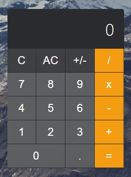

<h1 align="center">
    
</h1>

This Calculator App create following the <a href="https://github.com/florinpop17/app-ideas/blob/master/Projects/1-Beginner/Calculator-App.md" target="_blank" >App Ideas by Florin Pop</a> using <strong>ReactJs</strong> with <strong>TypeScript</strong>

<h2 align="center"><a href="https://robson16.github.io/calculator-app/" target="_blank" >Live Demo</a></h2>
